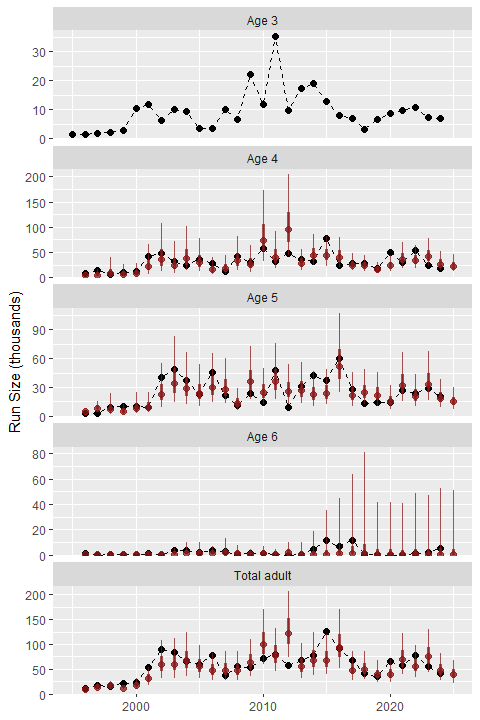

# sibregresr

This package is for forecasting salmon returns using sibling regression.
The core functions produce model average predictions (i.e., ensembles)
of dynamic linear models (DLMs) with sibling predictors. The package
also has functionality to forecast using DLMs with penalized-complexity
priors, which can be an alternative to model averaging.

See the *Overview* article for more details and information on package
functionality.

## Installation

You can install sibregresr from [GitHub](https://github.com/) with:

``` r
# install.packages("devtools")
devtools::install_github("wdfw-fp/sibregresr")
```

## Example

Below is an example of fitting an ensemble of 7 variations on a sibling
regression DLM and evaluating performance over 15 years. A beta version
plotting and table function are called to view the ensemble forecasts
with weights based on mean absolute percent errors.

See the *Overview* article for more details and examples.

``` r
library(sibregresr)

forecast<-forecast_fun(
  df = summer_chinook_2024,
  include = c("constIntOnly", "tvIntOnly", "tvSlope", "constLM",
    "tvCRzeroInt", "constCRzeroInt", "tvInt"),
  transformation = log,
  inverse_transformation = exp,
  scale_x = FALSE,
  scale_y = FALSE,
  perf_yrs = 15,
  wt_yrs = NULL,
)
#> [1] "Time for model fitting was 18.2 secs"

make_table(forecast$forecasts,"MAPE_weight")
```


``` r

make_plot(forecast$forecasts,"MAPE_weight")
```


