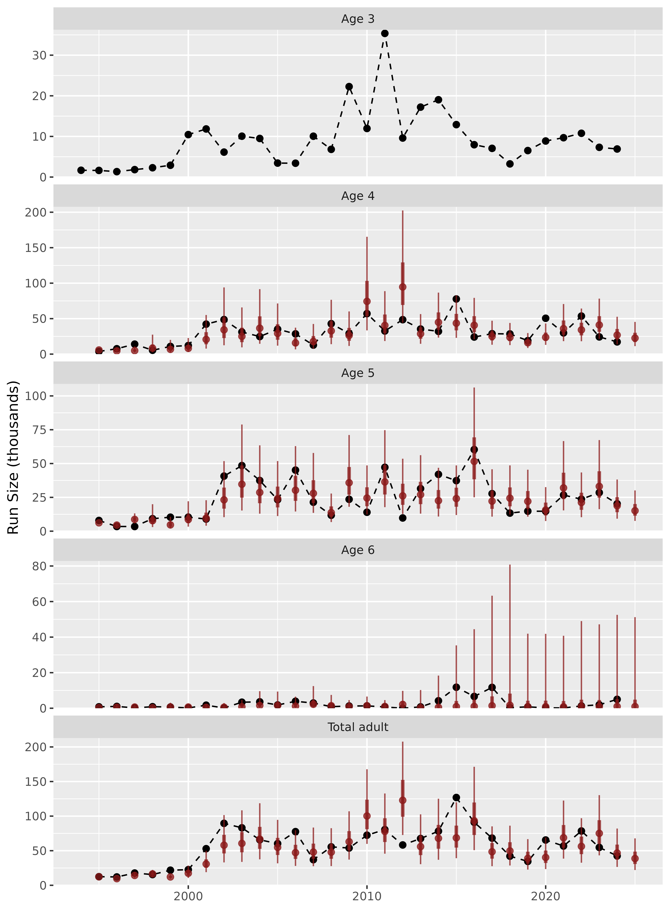

# Overview

## Introduction

This package is meant to forecast salmon returns using sibling
regression. The core functions produce model average predictions (i.e.,
ensembles) of dynamic linear models (DLMs) with sibling predictors. The
package also has functionality to forecast using DLMs with
penalized-complexity priors, which can be an alternative to model
averaging.

## Installation

You can install the development (the only) version of sibregresr from
[GitHub](https://github.com/wdfw-fp/sibregresr) with:

``` r
install.packages("devtools")
devtools::install_github("wdfw-fp/sibregresr")
```

``` r
library(sibregresr)
```

## Getting started

### Data format

One must provide a data frame of age-specific returns by either brood-
or return year, using specific column names. For example:

``` r
summer_chinook_2024 |> head(5)
#> # A tibble: 5 × 6
#>   BroodYear  Age3  Age4  Age5  Age6 Stock         
#>       <dbl> <dbl> <dbl> <dbl> <dbl> <chr>         
#> 1      1986  3197  7869  9145   287 Summer_Chinook
#> 2      1987  2699  4450  3816   335 Summer_Chinook
#> 3      1988  2569  5310  6180   356 Summer_Chinook
#> 4      1989  3862  7495  8503   795 Summer_Chinook
#> 5      1990  1405  5809  7917  1019 Summer_Chinook
```

or

``` r
brood_to_return(summer_chinook_2024)|> head(5)
#> # A tibble: 5 × 6
#> # Groups:   Stock [1]
#>   Stock          ReturnYear  Age3  Age4  Age5  Age6
#>   <chr>               <dbl> <dbl> <dbl> <dbl> <dbl>
#> 1 Summer_Chinook       1989  3197    NA    NA    NA
#> 2 Summer_Chinook       1990  2699  7869    NA    NA
#> 3 Summer_Chinook       1991  2569  4450  9145    NA
#> 4 Summer_Chinook       1992  3862  5310  3816   287
#> 5 Summer_Chinook       1993  1405  7495  6180   335
```

If multiple Stocks are included in the data, forecasting will be
conducted for each of the stocks. **Returns of the youngest age class
are not produced**, but rather are used as a predictor for forecasting
the second youngest age class. To forecast the youngest age class
(e.g. “Age3”), the data would need to be augmented with a “dummy” column
of a yet younger age class (e.g., “Age2”).

### Forecasting

Forecasts can be developed using the
[`forecast_fun()`](https://wdfw-fp.github.io/sibregresr/reference/forecast_fun.md)
function.

``` r

forecast<-forecast_fun(
  df = summer_chinook_2024,
  include = c("constIntOnly", "tvIntOnly", "tvSlope", "constLM",
    "tvCRzeroInt", "constCRzeroInt", "tvInt"),
  transformation = log,
  inverse_transformation = exp,
  scale_x = FALSE,
  scale_y = FALSE,
  perf_yrs = 15,
  wt_yrs = NULL,
)
#> [1] "Time for model fitting was 16.7 secs"
```

The arguments in the above call are set to the defaults, which includes
7 models in the ensembles, log transforms the response and predictor,
and does not scale the predictor and response prior to fitting. Models
can be fit in normal space by specifying `transformation = identity` and
`inverse_transformation = identity`. The response and predictors can be
Z-scored prior to fitting by specifying `scale_y = TRUE` and
`scale_x = TRUE`.

The `perf_yrs` argument specifies how many one-year-ahead forecasts to
conduct in order to assess performance of the model. The `wt_yrs`
argument specifies how many one-year-ahead forecasts to use for
performance-based model averaging (e.g., weighting based on MAPE). When
`wt_yrs` is NULL, the number of `perf_yrs` is also used for `wt_yrs`.
However, they don’t encessarily need to be the same. One could specify
`perf_yrs = 15` and `wt_yrs = 1` to conduct a 15-year performance
evaluation of the approach of weighting models based on their
performance solely in the previous year. It is also possible to use a
stretching window rather than a sliding window (i.e., include all
available years for performance and/or weighting) by setting `perf_yrs`
and/or `wt_yrs` at or above the total number of years in the data.

If `perf_yrs = 15` and `wt_yrs = 15` then `perf_yrs` + `wt_yres` + 1 =
31 years of one-step ahead forecasts for each component (i.e., not the
ensemble) model are needed for performance-based model weighting. This
is because the first of the 15 years of performance-based ensemble
forecasts uses weights based on performance of the components in the
previous 15 years. A call to
[`forecast_fun()`](https://wdfw-fp.github.io/sibregresr/reference/forecast_fun.md)
will produce a warning if the number of forecasts needed is greater that
the number of data points minus five (assuming at least five years
should be available to produce the first forecast).

### Output

The output of a call to the
[`forecast_fun()`](https://wdfw-fp.github.io/sibregresr/reference/forecast_fun.md)
function is a list of two data frames. The “fits” data frame has
information on the model fitting that could be useful if some of the
models failed to fit. The “forecasts” data frame has a row for every
year, age, stock, and model, including model averages. Included in the
data frame are the observed and forecasted returns as well as several
performance metrics. Definitions for all of the variables in the data
frame are prodived in the documentation for the
[`performance_weights()`](https://wdfw-fp.github.io/sibregresr/reference/performance_weights.md)
function, which can be accessed by a call to `?performance_weights()`.
The total forecast for returns summed across ages for a given model are
included with the sum of the component ages in the “Age” field. Fore
example, when forecasting returns of ages 4, 5, and 6, the total would
have a value of 15 in the “Age” field.

Here is an example of some of the information available in the
“forecasts” data frame – the predictions of all the different ensemble
models for the most recent year, ordered by MAPE for each year, and some
performance metrics.

``` r
forecast$forecasts |> dplyr::filter(ReturnYear==max(ReturnYear),grepl("weight",model_name)) |> dplyr::select(Stock,Pred,MAPE,RMSE,MPE,MEr) |> dplyr::arrange(Stock,Age,MAPE) |> dplyr::mutate(dplyr::across(where(is.numeric),round))
#> # A tibble: 16 × 8
#> # Groups:   Stock, Age, model_name [16]
#>      Age model_name    Stock           Pred  MAPE  RMSE   MPE   MEr
#>    <dbl> <chr>         <chr>          <dbl> <dbl> <dbl> <dbl> <dbl>
#>  1     4 RMSE_weight   Summer_Chinook 22678    39 18993    13  1878
#>  2     4 MAPE_weight   Summer_Chinook 22606    40 19475    14  2290
#>  3     4 MeanSA_weight Summer_Chinook 22794    43 20716    18  3885
#>  4     4 AICc_weight   Summer_Chinook 23323    47 24932    26  6311
#>  5     5 MAPE_weight   Summer_Chinook 15140    39  9690    16  -686
#>  6     5 MeanSA_weight Summer_Chinook 14880    40  9491    20   411
#>  7     5 RMSE_weight   Summer_Chinook 14884    40  9615    19    87
#>  8     5 AICc_weight   Summer_Chinook 13264    44 10272    29  3109
#>  9     6 MAPE_weight   Summer_Chinook   936 14321  4429 14244 -2072
#> 10     6 AICc_weight   Summer_Chinook   921 14479  4538 14398 -2181
#> 11     6 RMSE_weight   Summer_Chinook   966 14820  4363 14746 -2007
#> 12     6 MeanSA_weight Summer_Chinook   968 15007  4345 14933 -2004
#> 13   115 MAPE_weight   Summer_Chinook 38682    28 26788     5  -468
#> 14   115 RMSE_weight   Summer_Chinook 38528    29 26685     6   -42
#> 15   115 MeanSA_weight Summer_Chinook 38643    30 27909     9  2292
#> 16   115 AICc_weight   Summer_Chinook 37509    38 33700    17  7239
```

#### Prediction intervals

Prediction intervals are based on the standard deviation between
one-year ahead predictions (i.e., forecasts) and observations in log
space. The number of years included in the standard deviation
calculations is the minimum of the number of years available or the
values specified for `perf_yrs`. For example, if `perf_yrs = 15` but
only three years of an ensemble forecast had been generated prior to a
given year, those three years would be used to calculate the forecast
standard deviation and prediction intervals, however, if 20 years of the
ensemble forecast were available, only the most recent 15 years would be
used. The “n_sd” field in the output of a call to
[`forecast_fun()`](https://wdfw-fp.github.io/sibregresr/reference/forecast_fun.md)
provides the number of years used to calculate prediction intervals for
that forecast. The number of years used to calculate weights for an
ensemble forecast is conducted in the same way (i.e., all available up
to “wt_yrs”) and the “n_wts” field in the output gives the number of
years used. This is not relevant for ensembles based on AICc weighting
as they are based on the AICc value for models fit for the current year.

### Plotting and reporting (beta version)

I’ve also included a plotting function for predictions from a given
model with 50% and 90% prediction intervals. I haven’t spent much time
refining this though, so it is an area for further development.

``` r
make_plot(forecast$forecasts,"MAPE_weight")
```



Also a function for a high-level table.

``` r
make_table(forecast$forecasts,"MAPE_weight")
```

| Age   | Forecast | 50%CI           | 90%CI           | MAPE   | RMSE   | MPE    | MEr    | model_name  |
|-------|----------|-----------------|-----------------|--------|--------|--------|--------|-------------|
| 4     | 22,606   | 16,986 - 30,086 | 11,259 - 45,391 |  40    | 19,475 |  14    |  2,290 | MAPE_weight |
| 5     | 15,140   | 11,419 - 20,073 |  7,610 - 30,119 |  39    |  9,690 |  16    |  -686  | MAPE_weight |
| 6     |  936     |  181 - 4,830    |  17 - 51,231    | 14,321 |  4,429 | 14,244 | -2,072 | MAPE_weight |
| Total | 38,682   | 30,728 - 48,695 | 22,065 - 67,814 |  28    | 26,788 |  5     |  -468  | MAPE_weight |

I’ve started a report template, but quite a bit more work is probably
needed. If the forecasting has already been conducted with a call to
[`forecast_fun()`](https://wdfw-fp.github.io/sibregresr/reference/forecast_fun.md)
as above, you can generate the report with a call like:

``` r

forecast_report(forecast$forecasts,
                mod_name = "MAPE_weight",
                output_file = "Forcast report.docx"
                )
```

but you can also feed the
[`forecast_report()`](https://wdfw-fp.github.io/sibregresr/reference/forecast_report.md)
function the raw data and the arguments that you would feed to
[`forecast_fun()`](https://wdfw-fp.github.io/sibregresr/reference/forecast_fun.md)
in order to do it all in one function call. The disadvantage of this is
that you will only get the output for one model (e.g., “MAPE_weight”)
wheras if you fit save the output from a call to
[`forecast_fun()`](https://wdfw-fp.github.io/sibregresr/reference/forecast_fun.md),
you can investigate them all and render report for multiple models if
desired without having to refit.

## Under the `Forecast_fun()` hood

The `Forecast_fun()` is a wrapper around the
[`mod_funs()`](https://wdfw-fp.github.io/sibregresr/reference/mod_funs.md),[`setup_data()`](https://wdfw-fp.github.io/sibregresr/reference/setup_data.md),[`fit_mods()`](https://wdfw-fp.github.io/sibregresr/reference/fit_mods.md),
and
[`performance_weights()`](https://wdfw-fp.github.io/sibregresr/reference/performance_weights.md)
functions.

- [`mod_funs()`](https://wdfw-fp.github.io/sibregresr/reference/mod_funs.md)
  generates a list of functions that fit individual models. This list is
  passed to,
- [`setup_data()`](https://wdfw-fp.github.io/sibregresr/reference/setup_data.md),
  which generates a nested data frame with a row for each combination of
  subset of the data (i.e., with some number of years cutoff the end)
  and model. Each row represents a model that must be fit and prediction
  made, and this function kicks off the process using a list-column
  workflow.
- The
  [`fit_mods()`](https://wdfw-fp.github.io/sibregresr/reference/fit_mods.md)
  function does a few data transformation steps and conducts the model
  fitting.
- Finally, the
  [`performance_weights()`](https://wdfw-fp.github.io/sibregresr/reference/performance_weights.md)
  function uses the fitted model objects to produce forecasts, assesses
  performance, generates ensembles, and generates preduction intervals.

A similar output as generated by `Forecast_fun()` above could be
generated by the following code

``` r
mod_list<-mod_funs(c("constIntOnly", "tvIntOnly",
                     "tvSlope", "constLM", "tvCRzeroInt", "constCRzeroInt", "tvInt"))

setup<-setup_data(summer_chinook_2024,mod_list,n_forecasts = 31)

fits<-fit_mods(setup)

forecasts<-performance_weights(fits,perf_yrs = 15)
```

with the only difference being that the `Forecast_fun()` function
appends the observations in years for which forecasts were not produced
to the output.

## Penalized complexity models

Dynamic linear models with penalized complexity can be fit by including
“PenDlm”. **It is highly recommended to set `scale_x = TRUE` and
`scale_y = TRUE` when fitting the penalized models.** `wt_yrs = 1` below
to reduce the number of subsets of the data to fit models to because
there is no model averaging happening.

``` r
pen_dlm_forecast<-forecast_fun(
  df = summer_chinook_2024,
  include = c("PenDlm"),
  transformation = log,
  inverse_transformation = exp,
  scale_x = TRUE,
  scale_y = TRUE,
  perf_yrs = 15,
  wt_yrs = 1,
)
#> [1] "Time for model fitting was 6 secs"

pen_dlm_forecast$forecasts |> dplyr::filter(ReturnYear==max(ReturnYear),model_name=="PenDlm") |> dplyr::select(Stock,Pred,MAPE,RMSE,MPE,MEr) |> dplyr::arrange(Stock,Age,MAPE)|> dplyr::mutate(dplyr::across(where(is.numeric),round))
#> # A tibble: 4 × 8
#> # Groups:   Stock, Age, model_name [4]
#>     Age model_name Stock           Pred  MAPE  RMSE   MPE   MEr
#>   <dbl> <chr>      <chr>          <dbl> <dbl> <dbl> <dbl> <dbl>
#> 1     4 PenDlm     Summer_Chinook 23252    34 15868     8 -1223
#> 2     5 PenDlm     Summer_Chinook 14346    44 11257    16 -1232
#> 3     6 PenDlm     Summer_Chinook  1329 16306  3388 16253  -858
#> 4   115 PenDlm     Summer_Chinook 38928    26 23505     1 -3313
```

The penalized complexity model puts penalties on the across-year means
$\bar{\beta}$ of each coefficient $\beta_{t}$ for each year $t$, and the
standard deviation of the steps in the random walk. So if the
coefficients are:

$$\begin{aligned}
\beta_{t} & {= \beta_{t - 1} + \omega_{t}} \\
\omega_{t} & {\sim \mathcal{N}(0,\sigma)}
\end{aligned}$$

$$\bar{\beta} \sim \mathcal{N}(0,\tau)$$

This model puts exponential penalties on all $\tau$ and $\sigma$
parameters, for which there is a unique parameter for each predictor in
the model:

$$\begin{aligned}
{\sigma,\ \tau} & {\sim \exp(\lambda)} \\
 & 
\end{aligned}$$

the default value of $\lambda$ is 1 but can be tuned by the user.

Additionally, $0.01*\text{log}(\tau,\sigma)$ for all $\sigma$s and
$\tau$s is added to the log-likelihood to keep their values from
shrinking so small as to cause numerical problems during optimization.

### Non-sibling (e.g., climate) predictors

One can change the predictors for the penalized dlm model by providing a
data frame of predictor values by return year with a column called
“ReturnYear” or by brood year with “BroodYear” for joining with the
salmon return data. For example

``` r

covariates_24 |> head(5)
#> # A tibble: 5 × 11
#>   ReturnYear lag1_PDO lag2_PDO lag1_NPGO lag2_NPGO lag1_fall_Nino3.4
#>        <dbl>    <dbl>    <dbl>     <dbl>     <dbl>             <dbl>
#> 1       1961   0.563   NA          0.806    NA                -0.141
#> 2       1962  -0.109    0.547      1.09      0.795            -0.376
#> 3       1963  -0.808   -0.151     -0.482     1.09             -0.395
#> 4       1964   0.0579  -0.875     -0.495    -0.528             0.808
#> 5       1965  -0.496    0.0225     0.282    -0.541            -0.988
#> # ℹ 5 more variables: lag2_fall_Nino3.4 <dbl>, smolt_sock <dbl>,
#> #   lag1_log_socksmolt <dbl>, lag2_log_socksmolt <dbl>, pink_ind <dbl>
```

The model handles missing covariate values by fitting them as random
effects with a $\mathcal{N}(0,1)$ prior.

The formula for the model is provided to the
[`mod_funs()`](https://wdfw-fp.github.io/sibregresr/reference/mod_funs.md)
function and the covariate data to the
[`fit_mods()`](https://wdfw-fp.github.io/sibregresr/reference/fit_mods.md)
function, but both can be passed through the
[`forecast_fun()`](https://wdfw-fp.github.io/sibregresr/reference/forecast_fun.md)
function as well. When specifying the formula, “x” is used to represent
the sibling predictor. So the formula specified below would include the
sibling predictor as well as PDO and NPGO from two years prior to when
the fish return. In theory, the penalized complexity priors will shrink
the coefficients on colinear predictors, so it is ok to include them.

``` r
pen_dlm_forecast_cov<-forecast_fun(
  df = summer_chinook_2024,
  include = c("PenDlm"),
  transformation = log,
  inverse_transformation = exp,
  scale_x = TRUE,
  scale_y = TRUE,
  perf_yrs = 15,
  wt_yrs = 1,
  covariates = covariates_24,
  penDLM_formula =formula("y~ x + lag2_PDO + lag2_NPGO")
)
#> [1] "Time for model fitting was 9.8 secs"

pen_dlm_forecast_cov$forecasts |> dplyr::filter(ReturnYear==max(ReturnYear),model_name=="PenDlm") |>
  dplyr::mutate(model_name="PenDlm_cov") |> 
dplyr::select(Stock,Pred,MAPE,RMSE,MPE,MEr) |> dplyr::arrange(Stock,Age,MAPE)|> dplyr::mutate(dplyr::across(where(is.numeric),round))
#> # A tibble: 4 × 8
#> # Groups:   Stock, Age, model_name [4]
#>     Age model_name Stock           Pred  MAPE  RMSE   MPE   MEr
#>   <dbl> <chr>      <chr>          <dbl> <dbl> <dbl> <dbl> <dbl>
#> 1     4 PenDlm_cov Summer_Chinook 23969    37 16688    12   318
#> 2     5 PenDlm_cov Summer_Chinook 14352    46 13780     9 -3250
#> 3     6 PenDlm_cov Summer_Chinook  1024 16312  3371 16256  -874
#> 4   115 PenDlm_cov Summer_Chinook 39345    29 24316     1 -3805
```

The shape and scale parameters of the gamma prior can be controlled with
the `penDLM_gamma_shape` and `penDLM_gamma_scale` arguments to
[`mod_funs()`](https://wdfw-fp.github.io/sibregresr/reference/mod_funs.md)
or
[`forecast_fun()`](https://wdfw-fp.github.io/sibregresr/reference/forecast_fun.md).
The fraction of the log of the $\sigma$s that is added to the
log-likelihood can be controlled with the `penDLM_regu` argument.

## More general description of the modeling process

The first step in forecasting the returns of a given stock $y_{a,t}$ of
age $a$ in year $t$ is to fit models to observed returns through year
$t - 1$. The models available in this package are variations of a
sibling regression model with time-varying intercept and slope:

$$\left\{ \begin{aligned}
{{log}\left( y_{a,t} \right)} & {= \alpha_{t} + {log}\left( y_{a - 1,t - 1} \right)\beta_{t} + v_{t},} & \quad & {v_{t} \sim \mathcal{N}\left( 0,V_{t} \right),} \\
\alpha_{t} & {= \alpha_{t - 1} + w_{\alpha,t},} & \quad & {w_{\alpha,t} \sim \mathcal{N}\left( 0,W_{\alpha,t} \right),} \\
\beta_{t} & {= \beta_{t - 1} + w_{\beta,t},} & \quad & {w_{\beta,t} \sim \mathcal{N}\left( 0,W_{\beta,t} \right),}
\end{aligned} \right.$$

where $\alpha_{t}$ and $\beta_{t}$ are an intercept and a slope for the
log-transformed returns of the previous age in the previous year,
respectively, and both are allowed to vary across years as random walks
with process error variances $w_{\alpha,t}$ and $w_{\beta,t}$
respectively. The residual $v_{t}$ is assumed to be normally distributed
around zero with variance $V_{t}$. Together with a vague prior
distribution for the values of $\alpha_{0}$ and $\beta_{0}$ (the slope
and intercept prior to the first year) these equations define the “full”
sibling regression models. However, this “full” model may be overly
complex for optimal prediction, and is difficult to fit in practice.

Other models are simplified versions of the full model where:

1.  the slope is assumed to constant through time (i.e.,
    $w_{\beta,t} = 0$);  
2.  the intercept is assumed to be constant through time;  
3.  the slope and intercept are assumed to be constant through time;  
4.  the intercept is assumed to be zero (i.e., $\alpha_{t} = 0$);  
5.  the intercept is assumed to be zero and the slope is assumed to be
    constant through time;  
6.  the slope is assumed to be zero; and  
7.  the slope is assumed to be zero and the intercept is assumed to be
    constant through time.

These models are fit using the `dlm` package (Petris 2010) within this
`sibregresr` package. The penalized version of the full DLM is fit using
`RTMB` (Kristensen 2024).

Ensemble forecasts are generated by taking a weighted average of
predictions from multiple model. Ensemble model weights are calculated
for each model $m$ in the set ($\mathcal{M}$) of 8 models based on their
AICc,

$$w_{m} = \frac{e^{- 0.5{({AIC}_{m} - {AIC}_{\min})}}}{\sum\limits_{i \in \mathcal{M}}e^{- 0.5{({AIC}_{i} - {AIC}_{\min})}}},$$

or based on their observed performance in previous years as measured by
the reciprocal of mean absolute percent error (MAPE), root mean square
error (RMSE), or mean symmetric accuracy (MeanSA). For example,

$$w_{m} = \frac{{MAPE}_{m}^{- 1}}{\sum\limits_{i \in \mathcal{M}}{MAPE}_{i}^{- 1}}$$

### References

Giovanni Petris (2010). An R Package for Dynamic Linear Models. Journal
of Statistical Software, 36(12), 1-16. URL
<https://www.jstatsoft.org/v36/i12/>.

Kristensen K (2024). RTMB: ‘R’ Bindings for ‘TMB’. R package version
1.6, URL <https://github.com/kaskr/RTMB>.

Petris, Petrone, and Campagnoli. Dynamic Linear Models with R. Springer
(2009).
